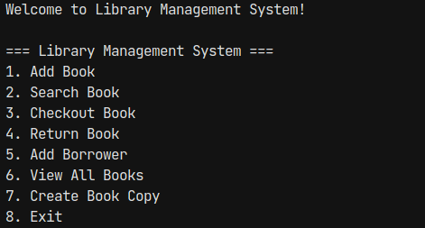
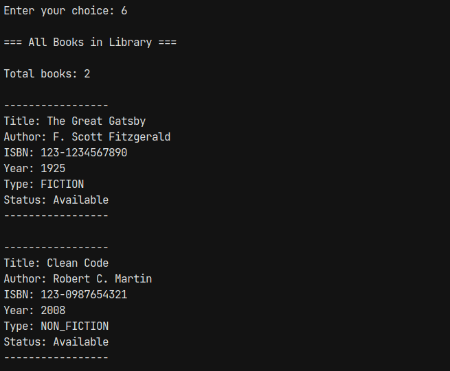
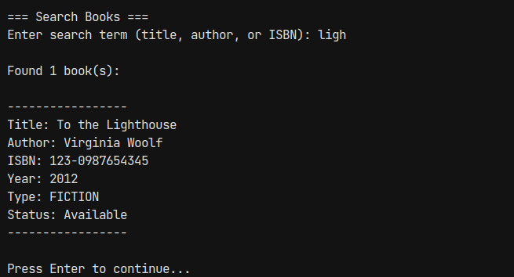
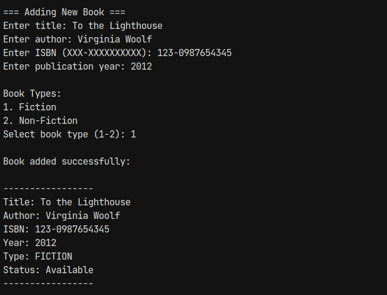
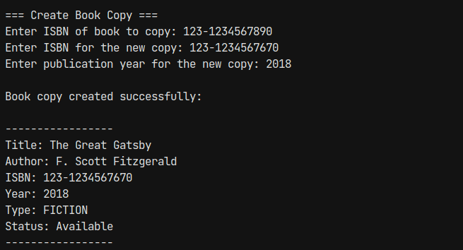
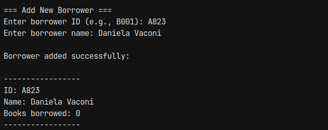
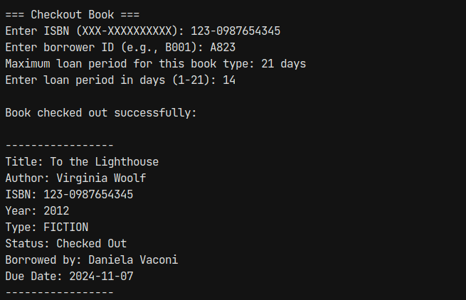
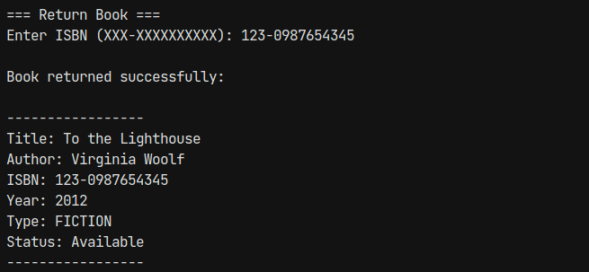
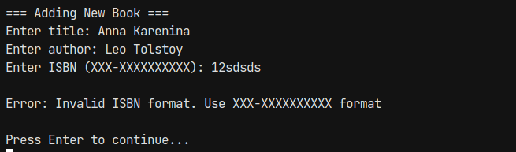

# Laboratory Work #1 - Creational Design Patterns

## Author: Daniela Vornic, FAF-222

---

## Objectives

- Get familiar with the Creational DPs;
- Choose a specific domain;
- Implement at least 3 CDPs for the specific domain.

## Theory

The goal of creational DPs is to provide advanced mechanisms to control object creation. These include mechanisms for instantiation, customization of the properties and components of structure as well as reuse of existing code. Some of the major techniques used in this domain include:

- **Singleton Pattern**: Ensures a class has only one instance and provides a global point of access to it.
- **Factory Method Pattern**: Defines an interface for creating objects, but lets subclasses decide which class to instantiate.
- **Abstract Factory Pattern**: Provides an interface for creating families of related objects without specifying their concrete classes.
- **Builder Pattern**: Separates the construction of a complex object from its representation.
- **Prototype Pattern**: Creates new objects by cloning an existing object.

## Domain of the application

The application is a Library Management System that allows librarians to:

- Add and manage books (fiction and non-fiction)
- Register borrowers
- Handle book checkouts and returns
- Track due dates and late fees
- Create copies of existing books
- Search for books

The system runs on a console interface and implements proper validation and error handling.

## Used Design Patterns

### Singleton Pattern

**Purpose**: Ensure a single instance of the library database throughout the application.

**Implementation**: The `LibraryDatabase` class implements the Singleton pattern, since it is a centralized data store for books and borrowers. The class has a private constructor and a static method `getInstance()` that returns the single instance of the class. The instance is created lazily and is thread-safe, along with the data structures used to store books and borrowers.

```java
public class LibraryDatabase implements ILibraryDatabase {
  private static volatile ILibraryDatabase instance;
  private final List<Book> books;
  private final List<Borrower> borrowers;

  private LibraryDatabase() {
    books = Collections.synchronizedList(new ArrayList<>());
    borrowers = Collections.synchronizedList(new ArrayList<>());
  }

  public static ILibraryDatabase getInstance() {
    ILibraryDatabase result = instance;
    if (result != null) {
      return result;
    }
    synchronized (LibraryDatabase.class) {
      if (instance == null) {
        instance = new LibraryDatabase();
      }
      return instance;
    }
  }

  // ...
}
```

### Factory Method Pattern

**Purpose**: Create different types of books (Fiction/Non-Fiction) while encapsulating the creation logic.

**Implementation**: The pattern is implemented through an abstract `BookCreator` class and concrete creators for each book type (`FictionBookSection` and `NonFictionBookSection`). The `BookCreator` class declares an abstract method `createBook()` that is implemented by the concrete creators to create specific book instances.

```java
// Abstract Creator
public abstract class BookCreator {
    public abstract Book createBook(String title, String author, String isbn, int year);
}

// Concrete Creator for Fiction Books
public class FictionSection extends BookCreator {
    @Override
    public Book createBook(String title, String author, String isbn, int year) {
        return new FictionBook(title, author, isbn, year);
    }
}

// Concrete Creator for Non-Fiction Books
public class NonFictionSection extends BookCreator {
    @Override
    public Book createBook(String title, String author, String isbn, int year) {
        return new NonFictionBook(title, author, isbn, year);
    }
}
```

```java
// Usage in BookService
public class BookService {
    private final Map<BookType, BookCreator> factories;

    private void initializeFactories() {
        factories.put(BookType.FICTION, new FictionSection());
        factories.put(BookType.NON_FICTION, new NonFictionSection());
    }
}
```

### Prototype Pattern

**Purpose**: Create copies of existing books (useful when adding new editions) while maintaining their type and properties.

**Implementation**: Implemented through the `clone()` method in the `Book` hierarchy, allowing creation of book copies.

```java
public abstract class Book implements Cloneable {
    @Override
    public Book clone() {
        try {
            Book clonedBook = (Book) super.clone();
            clonedBook.checkedOut = false;
            clonedBook.dueDate = null;
            clonedBook.borrower = null;
            return clonedBook;
        } catch (CloneNotSupportedException e) {
            throw new RuntimeException("Error cloning book", e);
        }
    }
}
```

```java
public Book createBookCopy(String existingIsbn, String newIsbn, int year) {
    Book existingBook = database.findBookByIsbn(existingIsbn);
    if (existingBook == null) {
        throw new LibraryException("Original book not found");
    }
    Book newBook = existingBook.clone();
    newBook.setISBN(newIsbn);
    newBook.setYear(year);
    database.addBook(newBook);
    return newBook;
}
```

## Implementation

The Library Management System is implemented in Java using the creational design patterns discussed above. The system consists of several key components, including the book hierarchy, service layer, user interface, and database layer.

### Key Components:

1. **Book Hierarchy**
   The abstract `Book` class serves as the base for all book types, such that `FictionBook` and `NonFictionBook` extend it with specific behaviors, mostly related to processing borrowing fees. It implements the Prototype pattern by overriding the `clone()` method.

2. **Service Layer**
   `BookService` handles book-related operations, while `BorrowerService` manages borrower operations. Services use dependency injection.

```java
public class BookService implements IBookService {
    private final ILibraryDatabase database;
    private final Map<BookType, BookCreator> factories;

    public BookService(ILibraryDatabase database, Map<BookType, BookCreator> factories) {
        this.database = database;
        this.factories = factories;
    }
    // ... service methods
}
```

As an example, this is the interface for the BookService:

```java
public interface IBookService {
  Book addBook(String title, String author, String isbn, int year, BookType type);
  Book checkoutBook(String isbn, String borrowerId, int loanPeriodDays);
  Book returnBook(String isbn);
  List<Book> searchBooks(String searchTerm);
  Book findBookByIsbn(String isbn);
  List<Book> getAllBooks();
  Book createBookCopy(String existingIsbn, String newIsbn, int year);
}
```

3. **User Interface**

It is a console-based UI with clear menu options. The inputs are validated and the errors are handled properly.

```java
public class ConsoleUI {
    private final IBookService bookService;
    private final IBorrowerService borrowerService;

    public void displayMenu() {
        System.out.println("\n=== Library Management System ===");
        System.out.println("1. Add Book");
        System.out.println("2. Search Book");
        // ... other options
    }
    // ... UI methods
}
```

```java
// Example of input validation
public static int readInt(String prompt, int min, int max) {
  System.out.print(prompt);
  try {
    int value = Integer.parseInt(scanner.nextLine().trim());
    if (value < min || value > max) {
      throw new LibraryException(
          String.format("Value must be between %d and %d", min, max));
    }
    return value;
  } catch (NumberFormatException e) {
    throw new LibraryException("Please enter a valid number");
  }
}
```

```java
public class LibraryException extends RuntimeException {
  public LibraryException(String message) {
    super(message);
  }
}
```

4. **Database Layer**

As mentioned before, the `LibraryDatabase` class implements the Singleton pattern. It uses synchronized collections to store books and borrowers, as shown in the snippet from the Singleton Pattern section.

## Screenshots / Results

In Figure 1, the main menu of the Library Management System is displayed, showing the available options for librarians. The system allows adding books, searching for books, registering borrowers, and handling book checkouts and returns.


_Figure 1: Main menu of the Library Management System_

From the database perspective, the system maintains a list of books and borrowers, as shown in Figure 2. The librarians can view all books in the library, add new books, and create copies of existing books. The system also allows searching for books by title, as shown in Figure 4.


_Figure 2: Viewing all books in the library_


_Figure 3: Searching for a book by title_

Using the Factory Method pattern, the system can create different types of books (Fiction and Non-Fiction) based on the user's input. Figure 4 shows the process of adding a new book to the library, where the librarian can choose the book type.


_Figure 4: Adding a new book to the library_

Using the Prototype pattern, the system can create copies of existing books while maintaining their type and basic properties. Figure 5 shows the process of creating a copy of an existing book by entering a new ISBN and publication year.


_Figure 5: Creating a copy of an existing book_

The system also allows librarians to register new borrowers and handle book checkouts and returns. Figure 6 shows the process of adding a new borrower to the system, while Figure 7 and Figure 8 demonstrate checking out and returning a book to the library.


_Figure 6: Registering a new borrower_


_Figure 7: Checking out a book to a borrower_


_Figure 8: Returning a book to the library_

Last but not least, the system provides validation and error handling for user inputs. Figure 9 shows an example of handling a validation error when the user enters an invalid number for the ISBN of a book.


_Figure 9: Handling validation errors in the UI_

## Conclusions

This laboratory work focused on implementing Creational Design Patterns in a Library Management System. The system uses Singleton, Factory Method, and Prototype patterns to manage the creation of books, borrowers, and book copies. It demonstrates how these patterns can be applied to create flexible and reusable object creation mechanisms in a real-world application, and how they can help improve the maintainability of the codebase.
