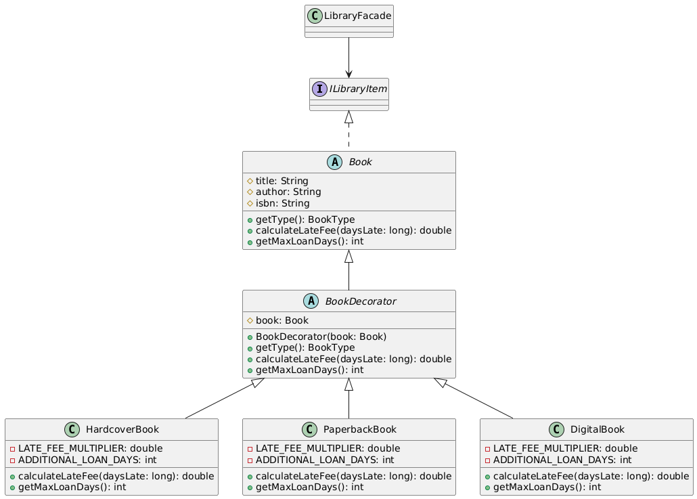

# Laboratory Work #2 - Structural Design Patterns

## Author: Daniela Vornic, FAF-222

---

## Objectives

1. Study and understand the Structural Design Patterns.
2. As a continuation of the previous laboratory work, think about the functionalities that your system will need to provide to the user.
3. Implement some additional functionalities using structural design patterns.

## Introduction

Structural patterns help developers organize code in a way that makes relationships between different parts of the system clearer and easier to manage. They describe how classes and objects can be composed, to form larger structures.

In my laboratory work, I explored three of these patterns - Composite, Decorator, and Facade - to add new features to my library system and improve its organization. The functionalities that I implemented are:

- Book series management - creating, adding books, listing, searching (uses **Composite pattern**);
- Book formats - hardcover, paperback, digital (uses **Decorator pattern**);
- Simplification of the system functionalities - includes the services for books, series and borrowing (uses **Facade pattern**);

## Implementation & Explanation

### Composite pattern

For the book series management I used the Composite pattern, since it allows to treat both individual objects and compositions of objects in the same way.
For example, the library has both books and series that consist of multiple books, and all of them are library items that can be listed, searched and categorized.In other words, from the tree-like structure viewpoint, books are the leaves and the series are containers.

By following the rules for the Composite pattern, I created a common interface for books and series, which is the `ILibraryItem` interface. The methods refer mostly to the book's status and display, such as availability, loan period, late fee, etc., since checking out and returning items applies to both.

```java
public interface ILibraryItem {
  String getTitle();
  boolean isAvailable();
  void checkOut(Borrower borrower, int loanPeriodDays);
  void returnItem();
  double calculateLateFee(long daysLate);
  String getDisplayInfo();
}
```

The `BookSeries` class is a composite that contains a list of "children" (`List<ILibraryItem> items`) and its identifying title. It has additional methods for adding books, and others that use streams and predicates to check properties of the child items, such as availability or other functionalities for borrowing. For example, ff the books in the series are not available, the series itself is not available for borrowing.

```java
public class BookSeries implements ILibraryItem {
  private final String title;
  private final List<ILibraryItem> items;

  public BookSeries(String title) {
    this.title = title;
    this.items = new ArrayList<>();
  }

  public void addItem(ILibraryItem item) {
    items.add(item);
  }

  @Override
  public String getTitle() {
    return title;
  }

  @Override
  public boolean isAvailable() {
    return items.stream().allMatch(ILibraryItem::isAvailable);
  }

  @Override
  public void checkOut(Borrower borrower, int loanPeriodDays) {
    if (!isAvailable()) {
      throw new LibraryException("Not all items in series are available");
    }
    items.forEach(item -> item.checkOut(borrower, loanPeriodDays));
  }

  // Other overridden methods
}
```

I also had to modify the `Book` class to implement the `ILibraryItem` interface. The methods for checking out and returning books are the same as for the series, and are not different from how they were written in the previous laboratory work.

To sum up, the main idea of how the Composite pattern is implemented in this project is shown in the UML diagram below. The client is `LibraryFacade` - the main class that interacts with the library items. The `Book` and `BookSeries` classes are the components, and the `ILibraryItem` interface is the common interface for both.


_Figure 1: Diagram for the implemented Composite pattern_

Even though for this project I only have one type of composite (`BookSeries` for books), the Composite pattern can be extended to have other types as well, such as collections of series/books and anthologies. All of them would be treated as a single entity, which is a library item.

### Decorator pattern

To handle diffeent book formats I implemented the Decorator pattern. The paperback, hardcover and digital formats are different because of borrowing properties (e.g. loan period, late fee), but they all have the same base properties of a book (e.g. title, author, availability).

To overcome this, the Decorator pattern suggests to add new responsabilities to the base class without changing its structure. I created an abstract `BookDecorator` class that extends `Book`, which is also abstract. By extending the `Book` class it inherently implements the `ILibraryItem` interface, as it is mentioned in the rules of this pattern. It contains the reference to the book item it "decorates" and it overrides the methods that need to be changed- `getType()`, `calculateLateFee()`, `getMaxLoanDays()`.

```java
public abstract class BookDecorator extends Book {
  protected Book book;

  public BookDecorator(Book book) {
    super(book.getTitle(), book.getAuthor(), book.getIsbn(), book.getYear());
    this.book = book;
  }

  @Override
  public BookType getType() {
    return book.getType();
  }

  @Override
  public double calculateLateFee(long daysLate) {
    return book.calculateLateFee(daysLate);
  }

  @Override
  public int getMaxLoanDays() {
    return book.getMaxLoanDays();
  }
}
```

For example, hardcover books have a longer loan period and a higher late fee than paperbacks, so in the child classes I override these methods. I have final fields for the loan period and late fee, which are set in the constructor of the concrete decorators that extend `BookDecorator`.

```java
package domain.models.decorators;

import domain.models.*;

public class HardcoverBook extends BookDecorator {
  private static final double LATE_FEE_MULTIPLIER = 1.5;
  private static final int ADDITIONAL_LOAN_DAYS = 7;

  public HardcoverBook(Book book) {
    super(book);
  }

  @Override
  public double calculateLateFee(long daysLate) {
    return super.calculateLateFee(daysLate) * LATE_FEE_MULTIPLIER;
  }

  @Override
  public int getMaxLoanDays() {
    return super.getMaxLoanDays() + ADDITIONAL_LOAN_DAYS;
  }
}
```

The other `PaperbackBook` and `DigitalBook` classes extend the `BookDecorator` class and override these methods in the same manner. Thus, the diagram for the Decorator pattern is shown below. This implementation uses abstract classes, compared to the classic examples, because it avoids code duplication and ensures that the methods are implemented in the child classes.


_Figure 2: Diagram for the implemented Decorator pattern_

The `LibraryFacade` acts as the client that creates decorated books based on the requested format. When `addBook()` is called, it creates a base book, and it wraps it in the right decorator based on the format.

```java
@Override
public Book addBook(String title, String author, String isbn, int year,
    BookType type, BookFormat format) {
  Book baseBook = bookService.addBook(title, author, isbn, year, type);

  return switch (format) {
    case HARDCOVER -> new HardcoverBook(baseBook);
    case PAPERBACK -> new PaperbackBook(baseBook);
    case DIGITAL -> new DigitalBook(baseBook);
  };
}
```

### Facade pattern

To simplify all the listed functionalities, I used the Facade pattern to manage all the service layers. Thus, the `LibraryFacade` class provides easier access to all the systems functionalities. This is its interface, with methods for adding books, finding books by ISBN, searching books, creating book copies, creating series, adding books to series, adding borrowers and checking out/returning items.

```java
public interface ILibraryFacade {
  Book addBook(String title, String author, String isbn, int year,
      BookType type, BookFormat format);
  Book findBookByIsbn(String isbn);
  List<Book> searchBooks(String searchTerm);
  List<Book> getAllBooks();
  Book createBookCopy(String existingIsbn, String newIsbn, int year);

  BookSeries createSeries(String title);
  void addBookToSeries(String seriesTitle, String isbn);
  List<BookSeries> getAllSeries();
  BookSeries findSeriesByTitle(String title);

  Borrower addBorrower(String id, String name);
  ILibraryItem checkoutItem(String itemId, String borrowerId, int days);
  ILibraryItem returnItem(String itemId);
}
```

As it can be seen, the `LibraryFacade` class implements all the methods that are needed to interact with the library aspects. It uses the services for books, series and borrowers to perform the operations, in addtion to the database for storing the items.

```java
public class LibraryFacade implements ILibraryFacade {
  private final IBookService bookService;
  private final IBorrowerService borrowerService;
  private final ISeriesService seriesService;

  public LibraryFacade() {
    ILibraryDatabase database = LibraryDatabase.getInstance();
    this.bookService = new BookService(database);
    this.borrowerService = new BorrowerService(database);
    this.seriesService = new SeriesService(database, bookService);
  }

  // Overridden methods ...
```

The `LibraryManagementSystem` class uses the `LibraryFacade` to interact with the library items and borrowers. Instead of initializing each service once by one, it simply instantiates the facade, which is further used for library initialization and the interaction with the handler for the console UI.

```java
public class LibraryManagementSystem {
  public static void main(String[] args) {
    ILibraryFacade libraryFacade = new LibraryFacade();

    LibraryInitializer initializer = new LibraryInitializer(libraryFacade);
    initializer.initializeWithSampleData();

    ConsoleUI ui = new ConsoleUI(libraryFacade);
    ui.start();
  }
}
```

To illustrate, the diagram for the Facade pattern is shown below. The `LibraryFacade` class is the facade that provides a simplified interface to the client, which is the `LibraryManagementSystem`. The facade uses the services for books, series and borrowers to perform the operations.


_Figure 3: Diagram for the implemented Facade pattern_

Last but not least, during this lab, I also restructured the project to have a more clear organization. For example, I create folders for `enums` and `interfaces` and for the decorators, I created a folder `decorators` in the `models` folder.

## Screenshots / Results

In Figure 3 it is shown the added options in the main menu for the library system. They include creating a book series, adding books to it, viewing all the series. The search is included in the "Search books" option.


_Figure 3: Main menu changes_

Figure 4 depicts how the user can create a book series using the title, and, optionally, in the same operation to add books by their ISBN codes. It can add as many books as needed, and the series will display the availability status based on the books' statuses.


_Figure 4: Book series functionality_

Lastly, when adding a new book the user is prompted to choose its format - hardcover, paperback or digital. The system will create the book with the chosen format and display it in the list of all books. The max loan period and late fee are different for each format, and are also displayed.


_Figure 4: Book format prompt when adding a new book_

## Conclusions

In conclusion, studying and coding using some of the structural design patterns helped me understand how to extend a system's functionality in a more efficient way. While implementing these patterns, I realized how they naturally correspond to common library concepts - like how a book series is essentially a collection of books that should be treated both individually and as a whole. Regarding the Decorator pattern, it made the addition of book formats option more elegant. It made me reflect if the factory pattern for book types (fiction, non-fiction) was the best choice in the previous laboratory, but I decided to keep it as it is. Finally, the Facade pattern seemed the most intuitive to use, and it made the code cleaner and more organized, which was especially helpful in the implementation of the console UI.

Overall, this project was a good exercise in applying structural DPs, and I am looking forward to using them in future projects as well.
