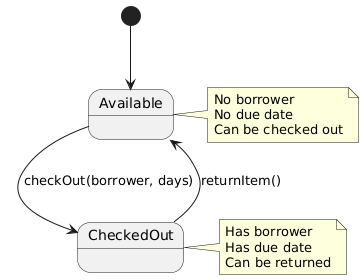
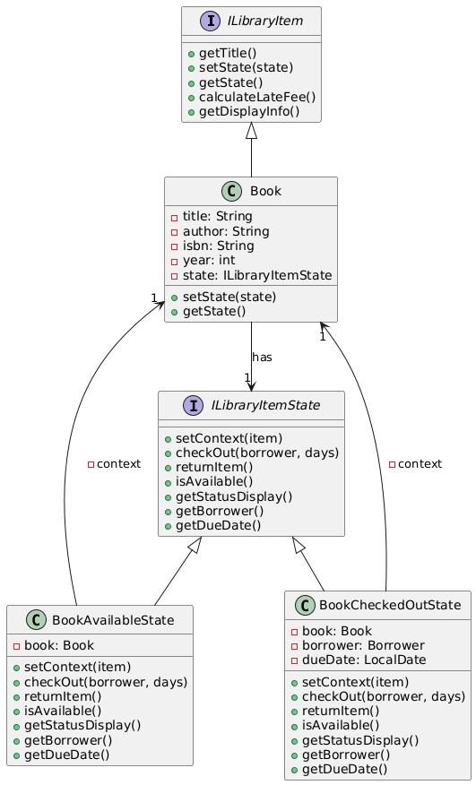
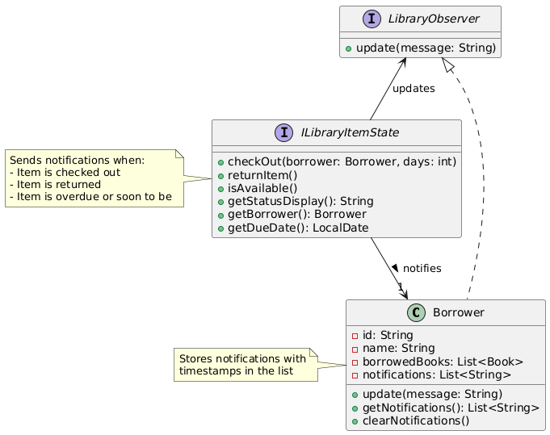
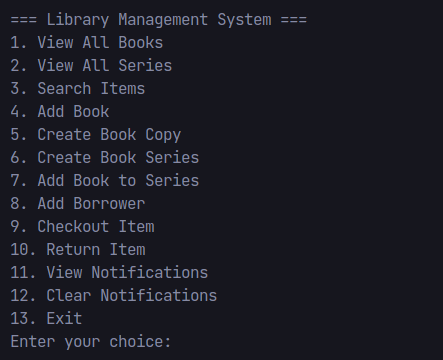
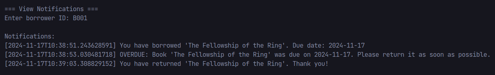

# Laboratory Work #3 - Behavioral Design Patterns

## Author: Daniela Vornic, FAF-222

---

## Objectives

1. Study and understand the Behavioral Design Patterns.
2. As a continuation of the previous laboratory work, think about what communication between software entities might be involed in your system.
3. Implement some additional functionalities using behavioral design patterns.

## Introduction

Behavioral patterns are about communication between objects, focusing on how objects behave and share responsibilities. In this laboratory work, I used two behavioral patterns - State and Observer - to improve existing code and add a new feature to my library system.

The functionalities that I implemented are:

- State management for library items - managing checkout and transitions (uses **State** pattern)
- Basic notification system for borrowers - tracking checkouts, returns, and overdue items (uses **Observer** pattern)

## Implementation & Explanation

### State Pattern

To better manage the status of library items - books and series, I refactored the code to use the State pattern. Previously, the status was managed using boolean flags and direct field access (`boolean isAvailable` and such). The State pattern is useful here, when an object can change its behavior when its internal state changes.

For instance, in Figure 1 it is shown the state diagram for library items. The states are: `Available` and `CheckedOut`, and the transitions are: `checkout()` and `returnItem()`. It is a very simple example, but it shows the differences between the states and what actions are allowed in each state.


_Figure 1: State diagram for library items_

According to the pattern rules, I created an interface `ILibraryItemState` that defines the methods for the transitions. Then, I implemented 4 classes that represent the states and are related to books or series (since I used the Composite pattern in my last work): `BookAvailableState`, `BookCheckedOutState`, `SeriesAvailableState`, `SeriesCheckedOutState`.

```java
public interface ILibraryItemState {
    void setContext(ILibraryItem item);
    void checkOut(Borrower borrower, int loanPeriodDays);
    void returnItem();
    boolean isAvailable();
    String getStatusDisplay();
    Borrower getBorrower();
    LocalDate getDueDate();
}
```

As it can be seen in the code snippet above, the `ILibraryItemState` interface defines the methods for the transitions: `checkOut()` and `returnItem()`, as well as some getters for the status display, borrower, and due date.

Below is an example of the `BookAvailableState` class implementation:

```java
public class BookAvailableState implements ILibraryItemState {
    private Book book;

    @Override
    public void checkOut(Borrower borrower, int loanPeriodDays) {
        if (loanPeriodDays > book.getMaxLoanDays()) {
            throw new LibraryException("Maximum loan period exceeded");
        }

        BookCheckedOutState newState = new BookCheckedOutState();
        newState.setContext(book);
        newState.setBorrower(borrower);
        newState.setDueDate(LocalDate.now().plusDays(loanPeriodDays));
        book.setState(newState);
    }

    @Override
    public boolean isAvailable() {
        return true;
    }

    // ... other methods
}
```

The `BookAvailableState` class implements the `ILibraryItemState` interface and defines the behavior for the `checkOut()` method. It creates a new `BookCheckedOutState` object and sets it as the state of the book.

Given these states, I changed the `Book` and `BookSeries` classes to use the state pattern. The `Book` class now has a field `state` of type `ILibraryItemState` and delegates the behavior to the state object. When it is instantiated, the book is in the `Available` state.

```java
public abstract class Book implements ILibraryItem, Cloneable {
  // ... other fields
  private ILibraryItemState state;

  protected Book(String title, String author, String isbn, int year) {
    // ... other fields initialization
    this.state = new BookAvailableState();
    this.state.setContext(this);
  }

  // ... other methods
}
```

Context is set in the constructor of the `Book` class, and the state is initialized with the `BookAvailableState` object.

The `BookSeries` class is similar, but it has a list of items and delegates the behavior to each book in the series. Moreover, it was needed to update the `BookService`, `LibraryFacade` and `ConsoleUI` classes to use the new state pattern, instead of accesing the fields directly.

```java
// BookService.java
ILibraryItemState state = book.getState();
if (!state.isAvailable()) {
  throw new LibraryException("Book is already checked out until " + state.getDueDate());
}
```

To illustrate the State pattern for books, Figure 2 shows the relationships between the classes involved in the pattern. The concrete states are `BookAvailableState` and `BookCheckedOutState`, and the context is the `Book` class.


_Figure 2: State pattern for books_

### Observer Pattern

Like in a real library, it is important to notify the borrowers about the status of the items they borrowed. To implement this functionality, I used the Observer pattern. Borrowers are notified when they check out an item, return it, or when an item becomes overdue.

The observer interface is simple:

```java
public interface ILibraryObserver {
    void update(String message);
}
```

The `Borrower` class implements the `ILibraryObserver` interface and is notified when an event occurs. There is a new field that stores string messages about the events.

```java
public class Borrower implements ILibraryObserver {
  // ... other fields
  private List<String> notifications;

  public Borrower(String id, String name) {
    // ... other fields initialization
    this.notifications = new ArrayList<>();
  }

  @Override
  public void update(String message) {
    // Do not add duplicate notifications
    if (notifications.stream().anyMatch(n -> n.contains(message))) {
      return;
    }

    String timestamp = LocalDateTime.now().toString();
    notifications.add(String.format("[%s] %s", timestamp, message));
  }

  // ... other methods
}
```

The new `update(String message)` method adds a new notification to the list, but only if it is not a duplicate, using streams and lambda expressions. The notification message includes a timestamp and the actual message provided in the argument.

Now the whole notification system can be easily implemented from the state classes. For example, when a book is checked out, the borrower is notified:

```java
// BookAvailableState.java
@Override
  public void checkOut(Borrower borrower, double loanPeriodDays) {
    // ... other code
    borrower.update(String.format(
        "You have borrowed '%s'. Due date: %s",
        book.getTitle(),
        book.getState().getDueDate().format(DateTimeFormatter.ISO_LOCAL_DATE)));

  }
```

For the overdue items, I added a new method in the `LibraryFacade` class that checks all the items and notifies the borrowers if the due date is passed. It is a method that runs in the main loop of the application, such that it is called every time the user interacts with the system, to have "real-time" notifications.

The actual implementation of the `checkAllDueDates()` method is in the `BookService` class, where it iterates over all the items and checks if the due date is passed.

```java
// BookService.java
public void checkAllDueDates() {
  List<Book> books = database.getAllBooks();
  books.stream()
      .filter(book -> !book.getState().isAvailable())
      .forEach(book -> book.getState().checkDueDate());
}
```

Each checked out book and book series has a due date, and the `checkDueDate()` method is implemented in the concrete states. If the due date is passed, the borrower is notified:

```java
// BookCheckedOutState.java
@Override
public void checkDueDate() {
  LocalDate today = LocalDate.now();
  if (dueDate != null) {
    long daysUntilDue = ChronoUnit.DAYS.between(today, dueDate);

    if (daysUntilDue == 2) {
      borrower.update(String.format(
          "REMINDER: Book '%s' is due in 2 days (Due: %s)",
          book.getTitle(),
          dueDate.format(DateTimeFormatter.ISO_LOCAL_DATE)));
    } else if (daysUntilDue <= 0) {
      borrower.update(String.format(
          "OVERDUE: Book '%s' was due on %s. Please return it as soon as possible.",
          book.getTitle(),
          dueDate.format(DateTimeFormatter.ISO_LOCAL_DATE)));
    }
  }
}
```

In the code snippet above, the `checkDueDate()` method checks if the due date is passed and notifies the borrower accordingly. If the due date is in 2 days, a reminder is sent, and if it is passed, an overdue notification is sent. The borrower is notified only once for each event.

The overall architecture of the Observer pattern is shown in Figure 3. The `Borrower` class is the concrete observer, and the state classes (that implement the `ILibraryItemState` interface) are the subjects.


_Figure 3: Observer pattern for borrowers_

The client `LibraryFacade` has the `BorrowerService` field, which handles the borrower logic. The `BorrowerService` uses the methods from the `Borrower` class to get and clear the notifications.

```java
// BorrowerService.java
public List<String> getBorrowerNotifications(String borrowerId) {
  Borrower borrower = findBorrowerById(borrowerId);
  if (borrower == null) {
    throw new LibraryException("Borrower not found");
  }
  return borrower.getNotifications();
}

public void clearBorrowerNotifications(String borrowerId) {
  Borrower borrower = findBorrowerById(borrowerId);
  if (borrower == null) {
    throw new LibraryException("Borrower not found");
  }
  borrower.clearNotifications();
}
```

As it can be logically understood, the main menu and console UI handler are also updated to display the notifications for the borrowers.

## Screenshots / Results

The only visible changes in the application are the notifications for the borrowers. The user can see/clear the notifications by selecting the corresponding options in the main menu. The notifications are displayed in the console, as shown in the screenshots below.


_Figure 4: Main menu with the new options for notifications_


_Figure 5: Borrower notifications_

## Conclusions

In conclusion, the collaboration between the State and Observer patterns was very useful and made it easier to implement the new functionalities. Using the concrete states to notify the borrowers about the status of the items was a good choice, as it keeps the code clean and easy to locate. The Observer pattern was a bit more challenging to implement, because it needed changes in more classes and the addition of new methods, but it was worth it.

Overall, both patterns were convenitient for the library system, and they can be extended to add more features (e.g. new states, new types of notifications, new interactions between the classes).
